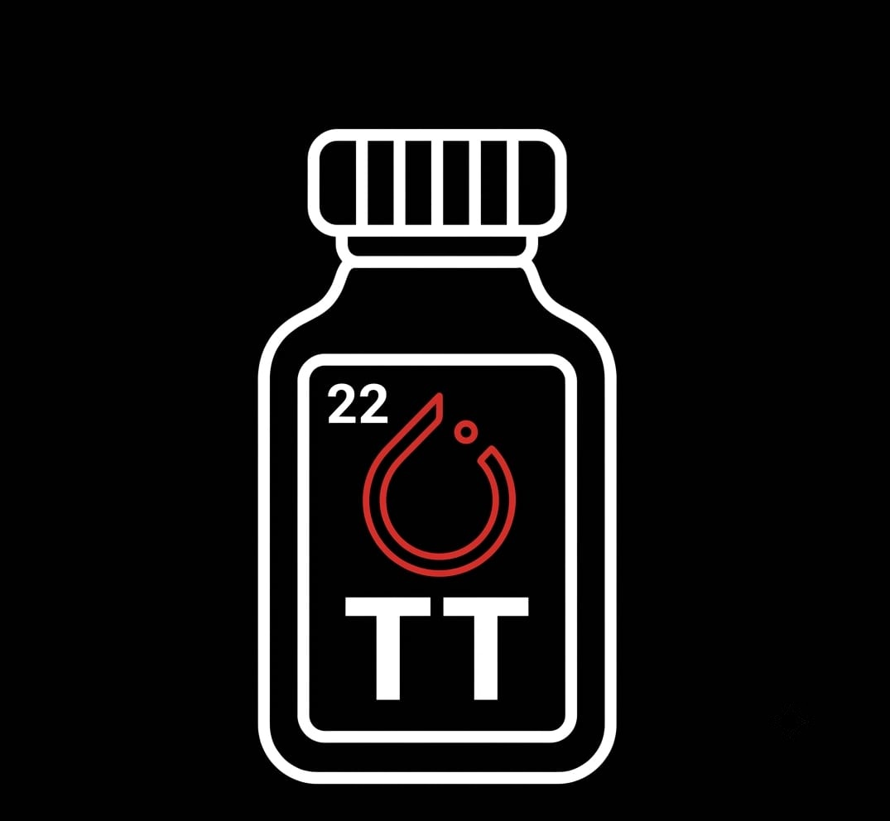

<table><tr><td></td><td><h1>TrenTorch-Web</h1></td></tr></table>

[](https://github.com/TrenTorch/TrenTorch-Web/actions/workflows/ci.yml)
[](#team-engineers)
[](LICENSE)

Learn PyTorch and Frontier ML by building your own PyTorch, in the browser.

The web version of [TrenTorch](https://github.com/TrenTorch/TrenTorch): the same from-scratch, module-by-module curriculum, without a local install.

Built with [SvelteKit](https://svelte.dev/docs/kit).

## Development

```bash
npm install
npm run dev -- --open
```

## Checks before pushing

```bash
npm run check   # svelte-check (types)
npm run lint     # prettier + eslint
npm run test     # vitest
npm run build    # production build
```

CI runs all of the above on every push and pull request.

## Recreating the scaffold

```bash
npx sv@0.17.0 create --template minimal --types ts --add prettier eslint tailwindcss="plugins:typography" vitest="usages:unit" --install npm .
```

---

## Team Engineers

(Recomputed nightly from real issue/PR activity once there's some to count -- see `.github/workflows/update-contributors.yml`.)

---

## License

MIT License - see [LICENSE](LICENSE) for details.
